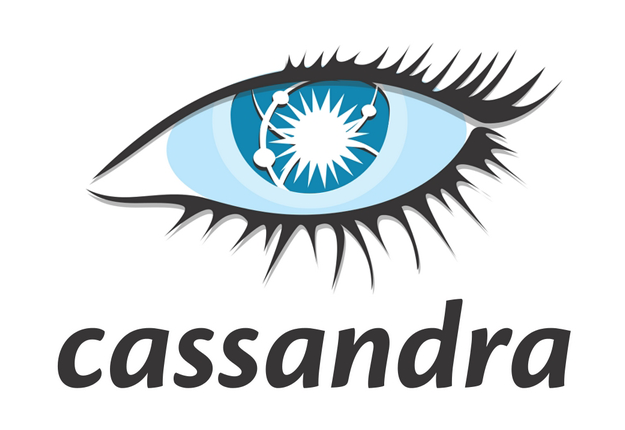

## Project Overview

This project is an exercise for data modeling with Cassandra and building an ETL pipeline using Python.  The dataset is a simulated dataset of a spotify-like startup. It includes songplay logs, song details and artist details. 

## Libraries Used:

The following libraries are used in this project:
- NoSQL: cassandra
- PyData: pandas, numpy
- Utilities: glob, os, json, csv, re

## How to Run:

Instructions can be found in the notebook file.

## Acknowledgement 

Credits to Udacity for the templates.
